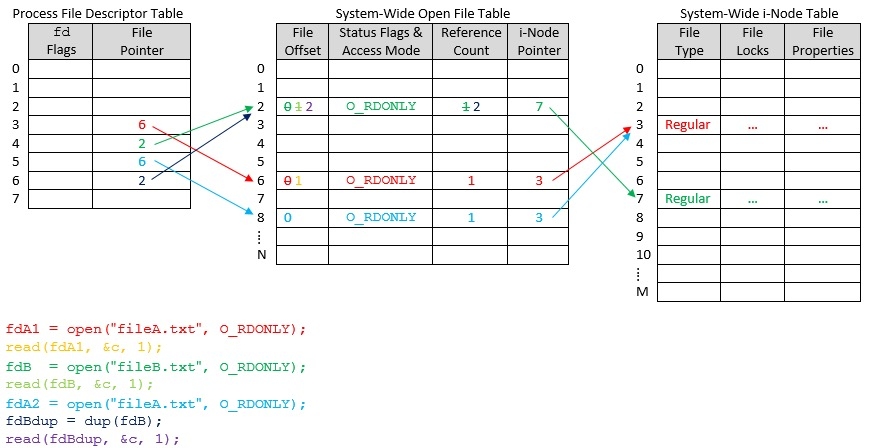

#### CMakeLists的常用变量

CMAKE_BINARY_DIR,PROJECT_BINARY_DIR,_BINARY_DIR：
这三个变量内容一致，如果是内部编译，就指的是工程的顶级目录，如果是外部编译，指的就是工程编译发生的目录。

CMAKE_SOURCE_DIR,PROJECT_SOURCE_DIR,_SOURCE_DIR：
这三个变量内容一致，都指的是工程的顶级目录。

CMAKE_CURRENT_BINARY_DIR    外部编译时，指的是target目录，内部编译时，指的是顶级目录

CMAKE_CURRENT_SOURCE_DIR    CMakeList.txt所在的目录

CMAKE_CURRENT_LIST_DIR      CMakeList.txt的完整路径

CMAKE_CURRENT_LIST_LINE     当前所在的行

CMAKE_MODULE_PATH           如果工程复杂，可能需要编写一些cmake模块，这里通过SET指定这个变量

LIBRARY_OUTPUT_DIR,BINARY_OUTPUT_DIR    库和可执行的最终存放目录

PROJECT_NAME：              工程名称

#### #define的深入用法

1. `#define process_str1(instr) #instr`

    `char str[] = process_str1(abc);`会预处理成`char str[] = "abc";`
    
2. `#define process(x) x`

    `int j = process(i);`会预处理成`int j = i;` 这里`i`是一个变量，否则会报错

3. `#define process_variable(x) a##x`

    `int x = process_variable(1);`会预处理成`int x = a1;` 这里`a1`是一个变量，否则会报错

#### 进程创建时的初始默认文件描述符

标准输入 -> 0(STDIN_FILENO)

标准输出 -> 1(STDOUT_FILENO)

标准错误 -> 2(STDERR_FILENO)

#### UNIX File Descriptors

